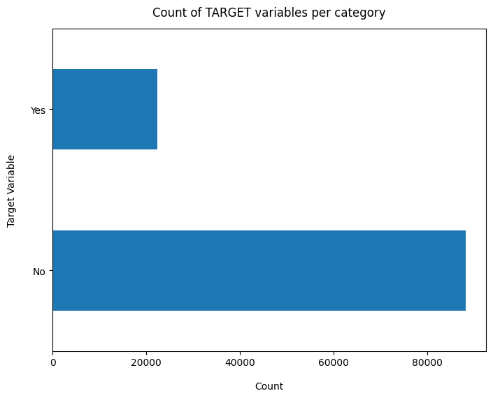
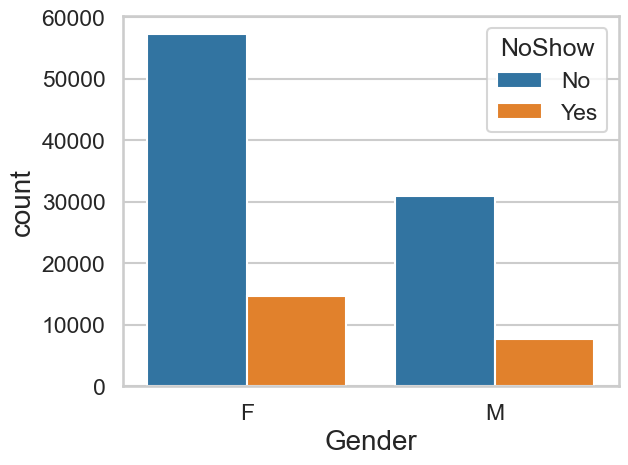
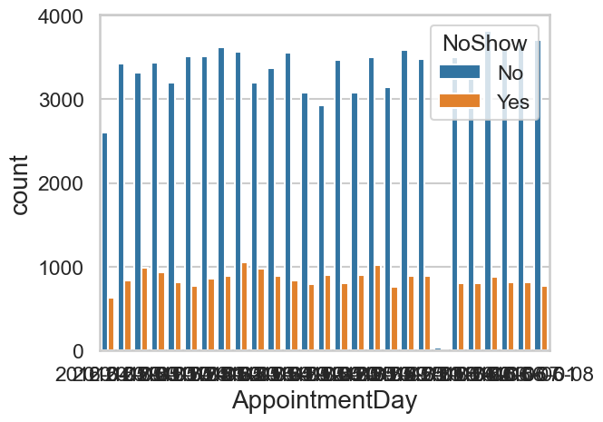

# Medical Appointments - EDA

## 📌 Project Overview
This project focuses on **Exploratory Data Analysis (EDA)** of medical appointment data to understand the factors that lead patients to miss their scheduled visits. By analyzing various demographic and clinical features, we aim to uncover patterns that can help healthcare providers reduce "No-show" rates and optimize clinic operations.

## 📊 Key Insights & Findings
Based on the analysis performed in the notebook:
* **Imbalanced Data:** About 80% of patients attend their appointments, while 20% are "No-shows."
* **Gender Trends:** Female patients take significantly more appointments than male patients.
* **Scheduling Patterns:** Appointments are highest from Monday to Wednesday and drop significantly toward the weekend. There are no appointments recorded on Sundays.
* **Health Conditions:** Patients with chronic conditions like Hypertension and Diabetes show a slightly higher attendance rate (~83-85%) compared to the general population.
* **SMS Paradox:** Interestingly, patients who received SMS reminders had a higher no-show rate (28%) than those who did not (16%), suggesting the timing or content of the reminders may need optimization.

## 🛠️ Tech Stack & Libraries
- **Python**: Core programming language.
- **Pandas**: For data manipulation and cleaning.
- **NumPy**: For numerical computations.
- **Matplotlib & Seaborn**: For generating statistical visualizations and heatmaps.
- **Datetime**: For feature engineering (extracting weekdays and months).

## 🚀 Workflow
1.  **Data Cleaning:** Correcting typos in column names (e.g., *Hipertension* to *Hypertension*) and handling patient IDs.
2.  **Feature Engineering:** * Converting date strings into `datetime` objects.
    * Creating a `Weekday` column to analyze daily trends.
    * Binning the `Age` variable into specific groups (e.g., 0-20, 21-40, etc.).
3.  **Univariate Analysis:** Analyzing the distribution of individual features like Gender and Scholarship.
4.  **Bivariate Analysis:** Comparing every feature against the `No-show` target variable to find correlations.
5.  **Correlation Heatmap:** Visualizing the relationship between all numerical features.

## 📂 Dataset Features
- **PatientId & AppointmentID**: Unique identifiers.
- **Gender**: Male or Female.
- **ScheduledDay**: The day the patient set up the appointment.
- **AppointmentDay**: The actual day of the visit.
- **Age**: Patient's age.
- **Neighbourhood**: Location of the hospital.
- **Scholarship**: Indicates if the patient is part of the 'Bolsa Família' social welfare program.
- **Hipertension, Diabetes, Alcoholism, Handcap**: Clinical conditions.
- **SMS_received**: If a reminder was sent.
- **No-show (Target)**: `Yes` (did not show up) or `No` (showed up).

## 📖 How to Run
1.  Clone this repository.
2.  Ensure you have the `Data.csv` file in the same directory.
3.  Install dependencies: `pip install pandas numpy matplotlib seaborn`.
4.  Run the Jupyter Notebook: `jupyter notebook Medical_Appointments_Data_EDA.ipynb`.

---
## Preview

| **Prev 1** | **Prev 2** |
| :--- | :--- |
|  |  |
| **Prev 3** | **Prev 4** |
|  |  |
